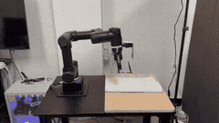
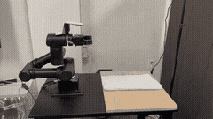

# 🤖 Vision-Based Towel Folding Robot with Imitation Learning

**A vision-based robotic system for towel flattening and folding**  
**Two-Stage Imitation Learning + Tunable Terminal Condition Classification (TTCC)**

<p align="center">
  
</p>

## Project Overview

This project investigates robotic manipulation of a crumpled towel. The robot first **flattens** the towel, then switches to a **folding** policy once the towel is sufficiently spread out.

Deformable objects continuously change shape, making the full task difficult to execute reliably with one policy. We divide it into two stages:

1. **Flattening policy** — reduces wrinkles and arranges the towel into a foldable state.
2. **Folding policy** — folds the flattened towel in half.

An external RGB-D camera and **Tunable Terminal Condition Classification (TTCC)** module automatically determine when to switch policies. Rather than using a black-box classifier, TTCC relies on interpretable measurements of rectangularity and height distribution.

> **Repository scope**  
> This is a curated research and portfolio repository rather than a ready-to-install package. It includes the core ROS2 nodes, launch structure, visual metrics, training and evaluation code, and experimental results. Some hardware-specific configuration files, datasets, and checkpoints may be omitted or simplified.

## Key Contributions

1. **Two-stage imitation learning** — divides long-horizon towel manipulation into separate `Flattening` and `Folding` ACT policies.
2. **Tunable Terminal Condition Classification** — uses quantitative RGB-D geometry metrics to decide when the towel is ready to fold.
3. **Real-time ROS2 integration** — combines OpenManipulator-Y, RealSense D405/D415 cameras, LeRobot ACT inference, teleoperated data collection, and trajectory execution.
4. **Interpretable policy switching** — provides adjustable thresholds based on rectangularity, height standard deviation, and height range.

## System Components

| Component | Description |
| --- | --- |
| Robot | ROBOTIS OpenManipulator-Y, 6-DoF arm + 1-DoF gripper |
| Wrist camera | Intel RealSense D405 |
| External camera | Intel RealSense D415 RGB-D camera |
| Middleware | ROS2 Jazzy |
| Learning framework | Hugging Face LeRobot + ACT (Action Chunking Transformer) |
| Primary task | Flattening and then folding a towel |

## Method

### 1. Teleoperated Data Collection

Flattening and folding demonstrations were collected through a leader–follower teleoperation system.

<p align="center">
  
</p>

Each demonstration contains wrist-camera images, follower robot joint states, leader robot joint trajectories, and keyboard-based episode-control events. The demonstrations are converted into observation-action datasets in LeRobot format.

### 2. Two-Stage Imitation Learning

| Stage | Policy objective | Dataset size | Training method |
| --- | --- | ---: | --- |
| Stage 1 | Flatten a crumpled towel into a foldable state | 60 episodes, including DAgger | ACT |
| Stage 2 | Fold the flattened towel in half | 30 episodes | ACT |

The policies are trained independently. During execution, TTCC selects the flattening or folding policy based on the current visual state.

### 3. Vision-Based Terminal Condition Classification

<p align="center">
  
</p>

RGB-D observations from an external RealSense D415 determine whether the towel is ready to fold:

1. Capture RGB-D images.
2. Reconstruct 3D points from the depth image.
3. Estimate the tabletop plane with RANSAC.
4. Generate a residual height map relative to the plane.
5. Extract the towel mask using residual-height and color cues.
6. Compute quantitative geometric metrics.
7. Select either the `FLATTEN` or `FOLD` state.

## TTCC Metrics

| Metric | Meaning | Desired direction |
| --- | --- | --- |
| **Rectangularity Fit (`Rfit`)** | Agreement between the towel mask and its minimum-area rectangle | Higher is better |
| **Height Std (`σh`)** | Standard deviation of height residuals within the towel region | Lower is better |
| **Height Range (`Δh`)** | Difference between the 5th and 95th percentile heights | Lower is better |

```text
if Rfit >= τ_rect and σh <= τ_std and Δh <= τ_range:
    decision = FOLD
else:
    decision = FLATTEN
```

These thresholds can be tuned for different environments.

## Threshold Sensitivity

| Setting | Rect Fit threshold | Height Std threshold | Height Range threshold | Purpose |
| --- | ---: | ---: | ---: | --- |
| Strict | `0.85` | `7 mm` | `18 mm` | Switch only when the towel is very flat |
| Relaxed | `0.77` | `15 mm` | `30 mm` | Switch earlier in noisier or less controlled environments |

<p align="center">
  
  
</p>
<p align="center"><em>Examples using strict thresholds</em></p>

<p align="center">
  
  
</p>
<p align="center"><em>Examples using relaxed thresholds</em></p>

## ROS2 Runtime Architecture

| Module | Role |
| --- | --- |
| `collect_data` | Saves teleoperated demonstrations in LeRobot dataset format |
| `inference_server` | Loads an ACT policy and returns action chunks through a ROS2 service |
| `kkm_control_client` | Requests flattening or folding actions and publishes robot trajectories |
| `realsense_towel_metrics` | Computes TTCC metrics and publishes `/towel/decision` |
| `open_manipulator_bringup` | Starts OpenManipulator-Y hardware, controllers, and initial motion |

## Experimental Results

| Condition | Success rate | Interpretation |
| --- | ---: | --- |
| Flattening only | `76.7%` | Reduced wrinkles from many initial states but could not resolve every case |
| Folding only | `93.3%` | Relatively reliable when the towel already began in a foldable state |
| Manual transition, Flatten → Fold | `63.3%` | Human-selected transition timing produced inconsistent long-horizon performance |
| **TTCC autonomous transition** | **`80.0%`** | Metric-based automatic switching was more reliable than manual switching |

Overall success depends not only on the policies, but also on **when the system switches from flattening to folding**. TTCC reduces failures caused by premature or delayed switching.

## Qualitative Results

<p align="center">
  
  
</p>

## Limitations and Failure Cases

- **Depth noise and reflective materials** can destabilize plane fitting and residual-height estimation.
- **Partial loss of the towel from the camera view** can reduce mask quality and distort rectangularity estimates.
- **Severe wrinkles or self-occlusion** may require several flattening actions.
- **Gripper slip or failed grasps** can cause execution failure even when the visual estimate is correct.
- **Threshold selection** can make the system repeat flattening too conservatively or switch to folding too early.

Future work could improve robustness through adaptive thresholds, a learned terminal classifier, and demonstrations covering more initial states.

## Repository Structure

```text
.
├── config/                         # Policy and runtime configuration examples
├── launch/                         # ROS2 launch files for data collection and inference
├── open_manipulator_bringup/       # OpenManipulator-Y hardware and simulation bringup
├── ros2_lerobot/                   # Core ROS2 nodes and utility modules
├── train&evaluation/               # Training and evaluation scripts
├── flat_model/, fold_model/        # Model configuration and evaluation artifacts
├── result/                         # Qualitative result images and GIFs
```

## Development Environment

| Component | Environment |
| --- | --- |
| OS | Ubuntu 24.04 LTS |
| ROS | ROS2 Jazzy |
| Python | 3.12 |
| GPU | RTX 5070 Ti |
| Learning framework | Hugging Face LeRobot |
| Cameras | Intel RealSense D415 / D405 |
| Robot | ROBOTIS OpenManipulator-Y |

## References

- [Hugging Face LeRobot](https://github.com/huggingface/lerobot)
- [ROBOTIS OpenManipulator](https://github.com/ROBOTIS-GIT/open_manipulator)


